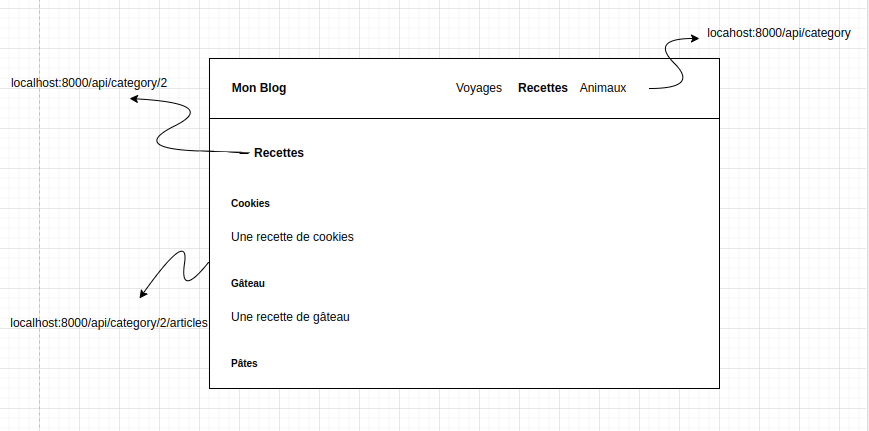
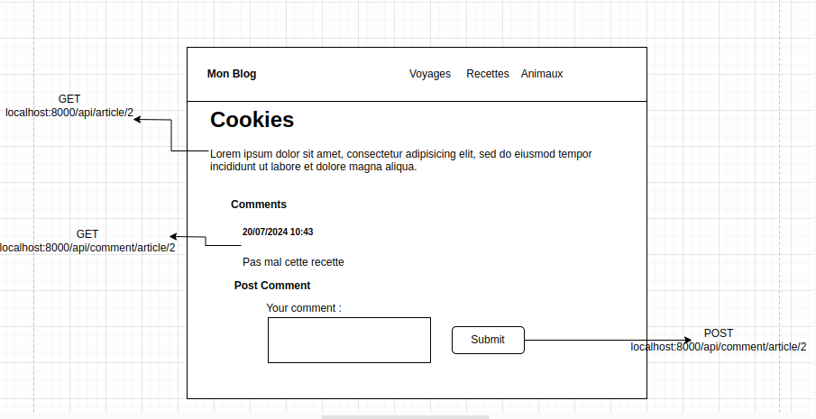

# Symfony With ORM
Un projet symfony avec l'ORM doctrine

## How To Use
1. Cloner le projet
2. Aller dans le dossier et faire un `composer install`
3. Créer un .env.local avec une url de connexion à une base de données
4. Créer la base de données `php bin/console do:da:cr`
5. On exécute la migration avec `php bin/console do:mi:mi`

## Les commandes principales et quand les utiliser

`php bin/console make:entity` (ou ma:en) : pour créer une entité via le cli avec ses propriétés et ses relations avec les autres entités (crée aussi les repositories). Peut également être utilisée pour modifier une entité existante.

`php bin/console make:migration` (ou ma:mi) : Pour créer un fichier de migration qui contiendra les requête SQL à exécuter pour passer de l'état actuel de la base de données à ce qu'on a définit dans nos entités. Je conseil de faire une migration une première fois quand on a définit toutes nos entités, puis d'en refaire seulement si en cours de projet on se rend compte qu'on a oublié des choses ou qu'on doit modifier notre structure de bdd

`php bin/console doctrine:migrations:migrate` (ou do:mi:mi) : Exécute toutes les migrations du projet, à exécuter quand on clone ou qu'on pull un projet, ou après avoir créer une migration avec ma:mi

`php bin/console doctrine:database:create` (ou do:da:cr) : Crée la base de données en se basant sur la DATABASE_URL

`php bin/console doctrine:database:drop` (ou do:da:dr) : Drop la base de données

### Workflow possible
1. Créer le .env.local avec mon DATABASE_URL
2. Créer la bdd avec do:da:cr
3. Créer les différentes entités avec leurs propriétés propres avec ma:en
4. Modifier les entités pour rajouter les relations (à nouveau avec ma:en en choisissant les entités existantes auxquelles on veut rajouter des relations)
5. Créer une migration avec ma:mi
6. Exécuter la migration avec do:mi:mi
7. Organiser un grand square dance pour fêter la création de notre couche data

## Repartir d'une base de données propre après un pull/clone
1. Supprimer la base de données : `php bin/console do:da:dr --force`
2. Si dans votre onglet git vous avez des nouveaux fichiers de migration, supprimez/annulez les
3. Recréer la base de données : `php bin/console do:da:cr`
4. Exécuter les migrations existantes : `php bin/console do:mi:mi`
5. Si vous avez fait de nouvelles entités ou modifier les entités, refaire une migration et un migrate : `php bin/console ma:mi` puis `php bin/console do:mi:mi`

## Maquettes du front
Maquettes des appels API qui seraient fait par le front end pour afficher les informations requises sur les pages

### Page d'une categorie

Ici, on considère qu'on a cliqué sur le lien pour la catégorie Recettes dans l'en-tête, on affiche donc l'en-tête avec les liste des catégories qu'on récupère de la base de données avec une requête GET. On récupère aussi la catégorie spécifique sur laquelle on se trouve actuellement via un GET by id. Enfin on récupère la liste des articles qui correspondent à cette catégorie via un autre appel GET by category

Ici, on est sur la page qui affiche un article spécifique. On fait donc une requête GET by id pour aller récupérer l'article à afficher. On fait également une requête GET by article pour aller chercher les commentaires de l'article. Enfin si on valide le formulaire, on fait un POST d'un commentaire sur l'article actuel

## Exercice
### Le contrôleur de l'Article
1. Générer un contrôleur (`php bin/console ma:con`) ArticleController
2. Rajouter un constructeur avec 2 arguments private, un ArticleRepository $repo et un EntityManagerInterface $em
3. Utiliser le $this->repo pour faire les 2 routes de GET sur /api/article et /api/article/{id}
4. Utiliser le $this->em->persist() suivi d'un $this->em->flush() pour faire le POST (comme on l'avait fait dans le projet avec les chiens). Avant de persist, pourquoi pas assigner la date de maintenant au createdAt.
5. Utiliser les mêmes méthodes du $this->em pour faire le PUT
6. Utiliser le $this->em->find et le $this->em->remove suivi d'un $this->em->flush() pour faire la suppression
7. Pour le plaisir, pourquoi pas faire de la validation : le title et le content ne doivent pas être vides, et on va dire que le title doit faire entre 3 et 100 caractères

### Entité Comment
1. En utilisant le make:entity, générer une entité Comment qui aura comme propriétés un content en text et un postedAt en datetime_immutable
2. Ajouter également une propriété qui s'appelera article et lui donner comme type relation et choisir la relation qui convient puis répondre aux questions que posera symfony
3. On valide pour terminer l'entité et on fait une migration avec ma:mi et do:mi:mi
4. Faire ensuite un CommentController avec une route globale /api/comment et un constructeur avec l'EntityManagerInterface et le CommentRepository en private
5. Créer une Route en GET qui pointera sur /api/comment/article/{id} et mettre un argument de type Article dans les paramètres de la route
6. À partir de là, deux possibilités, soit on utilise le CommentRepository pour faire un findBy et en lui donnant l'article, ou bien on renvoie en json le article->getComments()

### Entité Category
1. Générer une nouvelle entité Category avec un make:entity qui n'aura comme propriété qu'un label en string not null
2. Lui rajouter également une relation ManyToMany avec l'entité Article (relation accessible des deux côtés)
3. Faire la migration et l'exécuter
4. Rajouter un ou des Ignore du/des côté(s) où ça fait le plus de sens selon vous
5. Générer un CategoryController qui aura un GET classique, un POST classique aussi
6. Rajouter une route /api/category/{id}/articles qui permettra de récupérer tous les produits d'une category donnée